# Product 버젼으로 SES 오픈하기. 

- 이제 SES SandBox 를 벗어나, 프러덕 모드로 수행해 보자. 

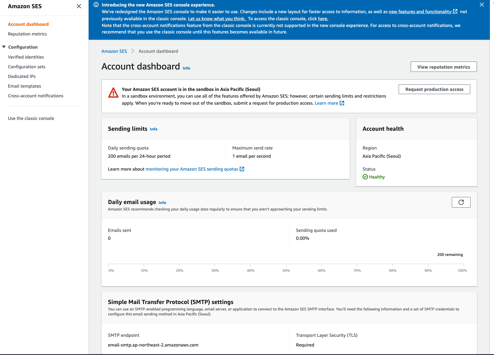

- 위와 같이 "Account dashboard" 메뉴로 들어가보자. 
- 알 수 있는 내용은 Sandbox 에서 메일 서비스가 진행되고 있음을 알 수 있다. 
- 그리고 Sending Limits 에 보면 하루에 200개의 메일만 보낼 수 있음을 알 수 있다. 

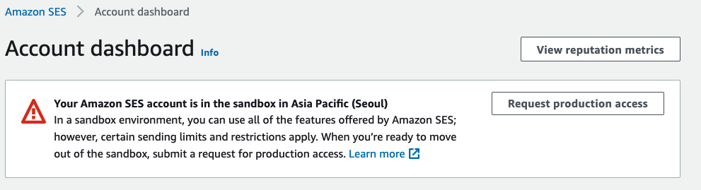

- "Request production access" 를 클릭해서 제품 모드로 동작하도록 요청하자. 

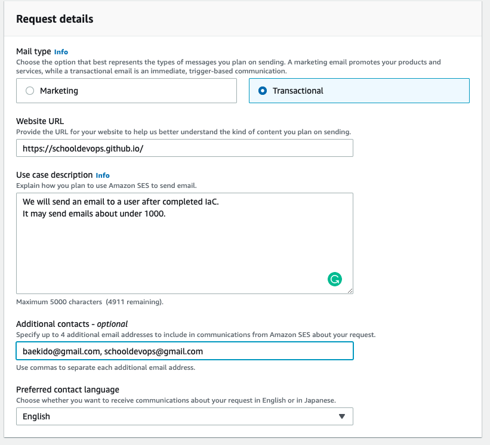

- Mail Type
  - Marketing: 마케팅용으로 메일을 전송하고자 할때 사용된다. 
  - Transactional: 특정 작업이 마치고 나면, 알림 등으로 보내고자 한다면 트랜잭셔널을 선택하자. 
- Website url
  - 메일을 보내는 주체가 되는 서비스의 URL 을 기입해 준다. 
  - 우리는 아직 어플리케이션 서버가 구체적으로 구성되지 않았으므로, github 주소를 그냥 입력해 봤다. 
- Use case description
  - 사용 상세 설명을 작성한다. 
  - 필자의 경우 단순하게 IaC가 끝나면 메일을 전송하고, 하루에 1000개 이하로 베일이 보내질 것이라고 작성했다.
- Additional contract - optional
  - 여러개의 메일을 기술해 주면 된다. 
- 선호하는 언어는 영어를 선택한다. 

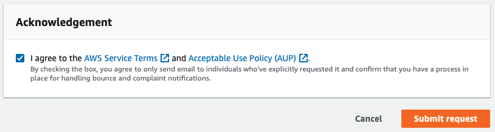

- 위와 같이 AWS 서비스 계약에 대한 체크를 하고 "Submit request"를 클릭한다.

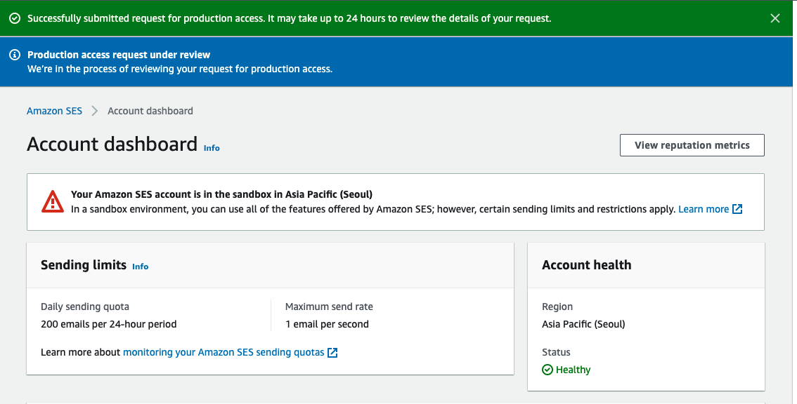

- 다시 Dashboard 에 들어가 보면, 요청이 수행 되었음을 확인할 수 있다.

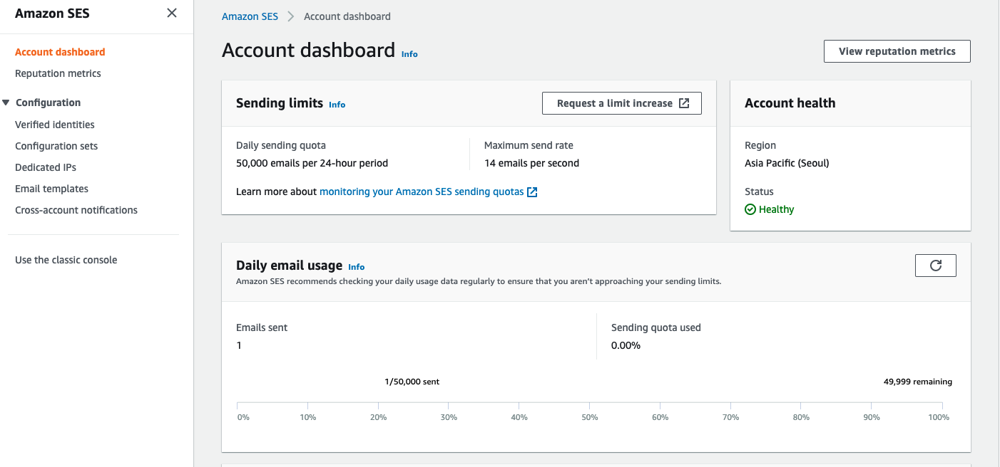

- 시간이 지나고, 요청이 승인 되었다면 위 화면과 같이 24시간 동안 50,000 건을 보낼 수 있다는 것을 확인할 수 있다.
- 또한 초당 14건의 메일을 전송할 수 있다는 내용을 확인할 수 있다. 

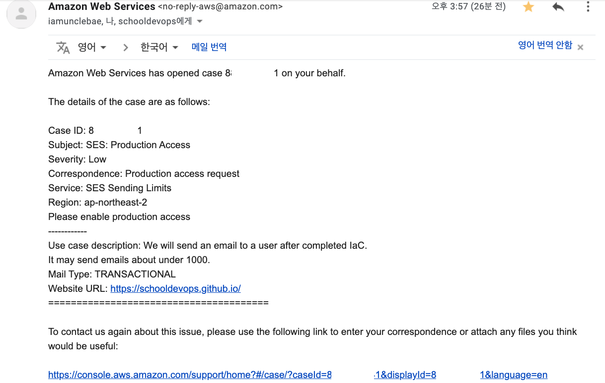
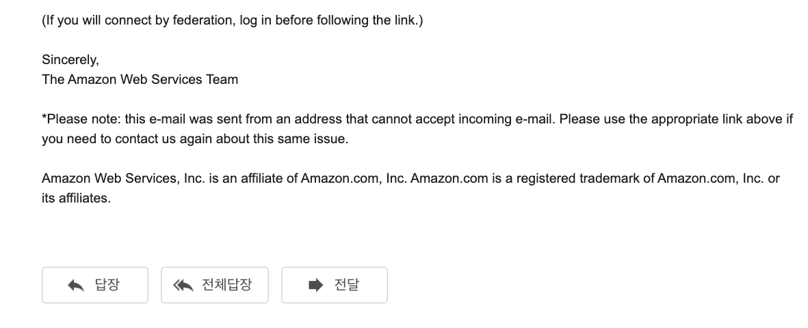

- 위 화면과 같이 요청에 대한 응답 메일을 확인할 수 있다. 

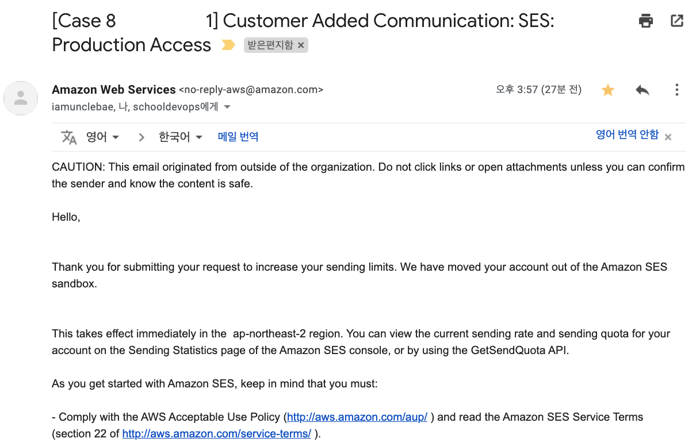
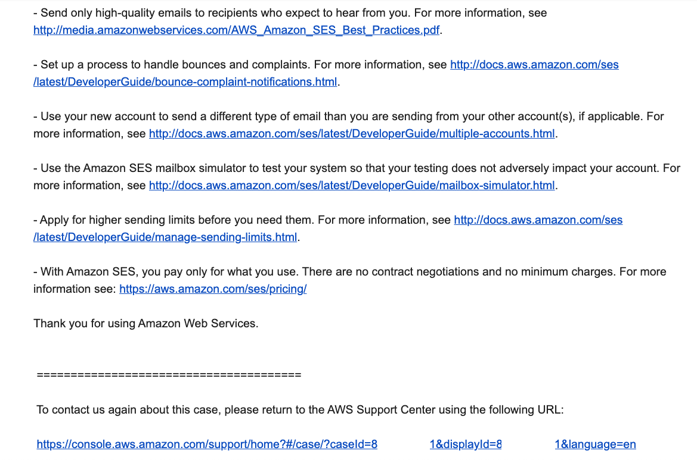
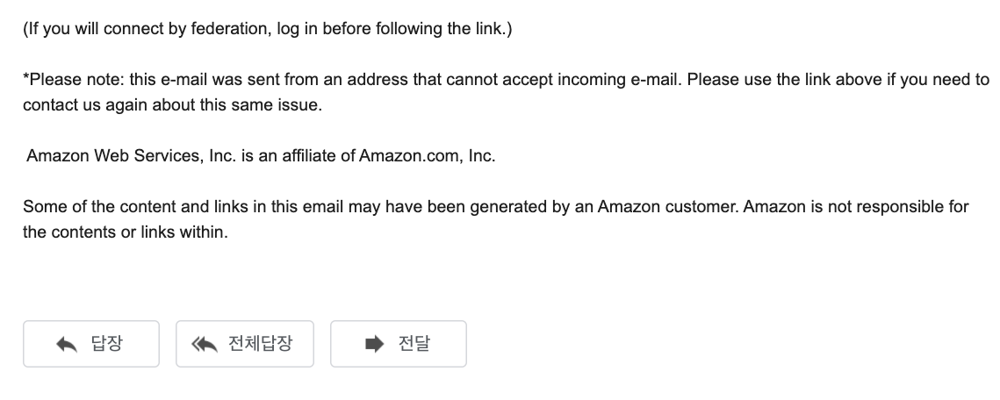

- 내용을 보면, 실제 메일 서비스가 샌드밖스 밖으로 이동 되었음을 알려 주고 있으며
- 서비스 리젼에 바로 해당 변경이 반영됨을 알려주고 있다. 
- 기타 문의 사항에 대한 자세한 가이드역시 제시해 주고 있다. 

## WrapUp 

- 서비스를 오픈하기 전에 SandBox 에서 충분히 테스트하고 나서 이동을 권장한다. 

