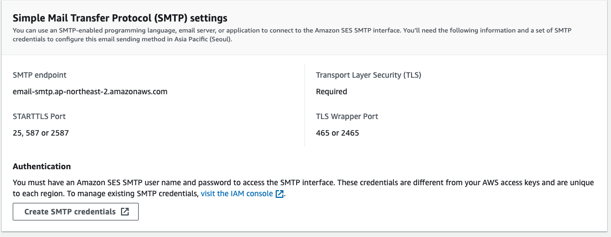
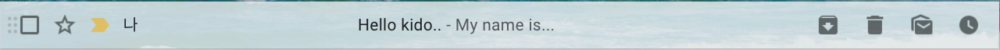
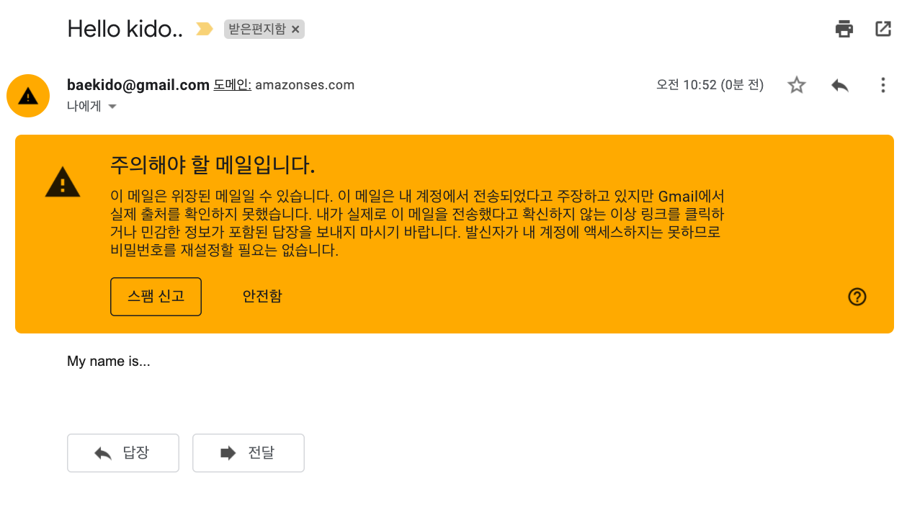
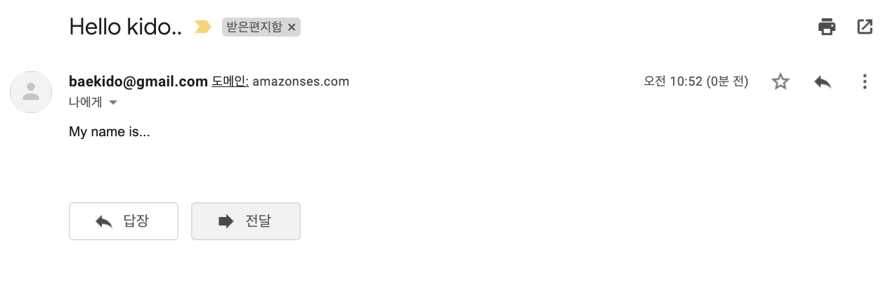

# SMTP 이용하여 연동하기.

## Overview

- AWS SDK를 이용하여 메일 전송을 수행할 수 있지만, 기존의 SMTP 를 그대로 이용하여 메일 전송 플로그램을 작성할 수 있다. 
- 우리는 이번 아티클에서 SMTP 를 이용한 메일 전송을 구현해 볼 것이다. 
- [다음 소스](https://docs.aws.amazon.com/ko_kr/ses/latest/DeveloperGuide/examples-send-using-smtp.html) 를 참조하여 개발하였다. 

## 메일 전송 개발하기

### 사전 준비사항

- AWS SES 리소스 생성하기
- 프로젝트 생성하기
- 라이브러리 의존성 추가하기
- SMTP 를 위한 설정 추가하기 

### 의존성 추가하기

- smtp 를 이용하기 위해서 SpringBoot Autoconfig 라이브러리를 다음과 같이 pom.xml 파일에 등록하자. 

```xml 
... 생략
		<!-- SpringBoot mail -->
		<dependency>
			<groupId>org.springframework.boot</groupId>
			<artifactId>spring-boot-starter-mail</artifactId>
		</dependency>
		<!-- SpringBoot mail -->
... 생략
		
```

### SMTP 를 위한 설정 추가하기

- SpringBoot Autoconfig 덕분에 우리는 아주 간편하게 의존성 설정을 추가할 수 있다. 
- /src/main/resources/application.properties 파일에 다음과 같의 의존성을 추가하자. 

```go
aws.ses.from=baekido@gmail.com

... 생략
# spring boot mail
spring.mail.protocol=smtp
spring.mail.host=email-smtp.ap-northeast-2.amazonaws.com
spring.mail.port=587
spring.mail.default-encoding=UTF-8
spring.mail.username=AXXXXXXXYYYYYZZZZZY
spring.mail.password=BEslkfjsldkfjaldkfjlwkfjldjkslkjvlskdbW

# Other smtp properties
spring.mail.properties.mail.smtp.auth=true
spring.mail.properties.mail.smtp.connectiontimeout=5000
spring.mail.properties.mail.smtp.timeout=5000
spring.mail.properties.mail.smtp.writetimeout=5000
# TLS port 587
spring.mail.properties.mail.smtp.starttls.enable=true
... 생략
```

- `spring.mail.protocol` 프로토콜은 smtp 이다.
- `spring.mail.host` host 파일은 ses를 생성한 리젼의 ses 엔드포인트를 작성한다. ses 메인 대시보드에서 아래와 같이 확인할 수 있다. 



- `spring.mail.port` 기본적으로 TLS를 이용해야하며, ses 메인 대시보드에서 확인한 값을 작성하면 된다. (위 이미지 참조)
- `spring.mail.default-encoding` 디플토 인코딩 값을 지정한다. 
- `spring.mail.username` 계정 생성은 AWS Console 에서 다음과 같이 생성할 수 있다. [Credential생성](./04.UsingSMTP.md) 참조
- `spring.mail.password` 계정 생성은 AWS Console 에서 다음과 같이 생성할 수 있다. [Credential생성](./04.UsingSMTP.md) 참조
- `spring.mail.properties.mail.smtp.auth` smtp 인증을 이용할 것인지 지정한다. (true로 지정하였다.)
- `spring.mail.properties.mail.smtp.connectiontimeout` 서버에 접속할 커넥션 타임아웃을 5초로 잡았다. 이 값은 어플리케이션의 특성에 맞게 적절히 잡아주자. 
- `spring.mail.properties.mail.smtp.timeout` smtp 전송후 결과까지 타임아웃을 지정한다. 
- `spring.mail.properties.mail.smtp.writetimeout` smtp 에 컨텐츠를 작성하기 까지 타임아웃을 지정한다.
- `spring.mail.properties.mail.smtp.starttls.enable` TLS 적용 여부를 설정한다. true를 지정하였다.

### Email Sender DTO 작성하기. 

- 메일을 전송할 dto 객체를 다음과 같이 작성하자.

```java 
package com.schooldevops.aws.mail.smtp.dtos;

public class MailDTO {

    private String to;
    private String subject;
    private String message;
    private boolean isHTML;
    private String attachFile;
    private String attachFilePath;

    public MailDTO() {
    }

    public MailDTO(String to, String subject, String message, boolean isHTML, String attachFile, String attachFilePath) {
        this.to = to;
        this.subject = subject;
        this.message = message;
        this.isHTML = isHTML;
        this.attachFile = attachFile;
        this.attachFilePath = attachFilePath;
    }

    public String getTo() {
        return to;
    }

    public void setTo(String to) {
        this.to = to;
    }

    public String getSubject() {
        return subject;
    }

    public void setSubject(String subject) {
        this.subject = subject;
    }

    public String getMessage() {
        return message;
    }

    public void setMessage(String message) {
        this.message = message;
    }

    public boolean isHTML() {
        return isHTML;
    }

    public void setHTML(boolean HTML) {
        isHTML = HTML;
    }

    public String getAttachFile() {
        return attachFile;
    }

    public void setAttachFile(String attachFile) {
        this.attachFile = attachFile;
    }

    public String getAttachFilePath() {
        return attachFilePath;
    }

    public void setAttachFilePath(String attachFilePath) {
        this.attachFilePath = attachFilePath;
    }
}


```

- 보는바와 같이 송신자, 제목, 내용, 수신자, HTML 여부 등의 속성이 정의되었다.
- 첨푸 파일이 있는 경우라면 attachFile 로 파일이름을, attachFilePath 로 파일 경로를 받도록 했다.

### Service 작성하기. 

- 이제는 서비스를 작성하자. 서비스는 SimpleMailMessage 를 이용하여 단순 메일을 전송하는 메소드를 작성한다. 
- 그리고 첨부파일이 있는 경우에도 메일을 전송할 수 있도록 MimeMessage 를 이용하는 예제도 추가하였다. 

```java 
package com.schooldevops.aws.mail.smtp.services;


import com.schooldevops.aws.mail.smtp.dtos.MailDTO;
import org.springframework.beans.factory.annotation.Autowired;
import org.springframework.beans.factory.annotation.Value;
import org.springframework.core.io.ClassPathResource;
import org.springframework.mail.SimpleMailMessage;
import org.springframework.mail.javamail.JavaMailSender;
import org.springframework.mail.javamail.MimeMessageHelper;
import org.springframework.stereotype.Service;

import javax.mail.MessagingException;
import javax.mail.internet.MimeMessage;

@Service
public class SmtpService {

    @Value("${aws.ses.from}")
    private String from;

    private final JavaMailSender javaMailSender;

    public SmtpService(JavaMailSender javaMailSender) {
        this.javaMailSender = javaMailSender;
    }

    public void sendMail(MailDTO mail) {
        if (mail != null && mail.getAttachFile() != null) {
            sendMailWithAttachments(mail);
        } else if (mail.isHTML()) {
            sendMailWithHTML(mail);
        } else {
            sendMailJustText(mail);
        }
    }

    /**
     * 단순 텍스트 전송
     * @param mail 전달할 메일 객체
     */
    public void sendMailJustText(MailDTO mail) {
        SimpleMailMessage msg = new SimpleMailMessage();
        msg.setTo(mail.getTo(), mail.getTo());
        msg.setSubject(mail.getSubject());
        msg.setText(mail.getMessage());
        msg.setFrom("baekido@gmail.com");

        javaMailSender.send(msg);
    }

    /**
     * HTML 형태로 메일 전송
     * @param mail 전달할 메일 객체
     */
    public void sendMailWithHTML(MailDTO mail){
        try {
            MimeMessage msg = javaMailSender.createMimeMessage();

            MimeMessageHelper helper = new MimeMessageHelper(msg, true);
            helper.setTo(mail.getTo());
            helper.setSubject(mail.getSubject());
            helper.setText(mail.getMessage(), mail.isHTML());

            javaMailSender.send(msg);
        } catch (MessagingException e) {
            e.printStackTrace();
        }
    }

    /**
     * 첨부 파일이 존재하는 메일 전송
     * @param mail 전달할 메일 객체 
     */
    public void sendMailWithAttachments(MailDTO mail){
        try {
            MimeMessage msg = javaMailSender.createMimeMessage();

            MimeMessageHelper helper = new MimeMessageHelper(msg, true);
            helper.setTo(mail.getTo());
            helper.setSubject(mail.getSubject());
            helper.setText(mail.getMessage(), mail.isHTML());
            helper.addAttachment(mail.getAttachFile(), new ClassPathResource(mail.getAttachFilePath()));

            javaMailSender.send(msg);
        } catch (MessagingException e) {
            e.printStackTrace();
        }
    }
}
```

- 메일 전송하기 위해서 sendMail 을 작성했다. 
- sendMail은 내용을 확인해서 첨부파일이 존재하는경우, HTML로 전송하는 경우, 단순 텍스트로 전송하는 경우로 분리했다.
- 만약 메일 내용이 복잡하거나 (첨부파일이 있는경우, 혹은 HTML 페이지 등) 인 경우에는 코드와 같이 MimeMessageHelper를 이용할 수 있다. 

### 테스트 메일 전송하기. 

- 이제 CommandLineRunner 를 이용하여 스프링 부트가 시작될떼 메일을 전송해 보자.

### 메일 결과  확인하기. 

- 메일 전송 결과는 다음과 같이 확인할 수 있다. 






- 정상적으로 메일 수신됨을 확인할 수 있다.

## WrapUp

- SMTP 를 이용하여 메시지 전송을 수행해 보았다. 
- SMTP 는 단순하면서도, 기존 다른 벤더 메일을 그대로 이용할 수 있는 장점이 있다. 