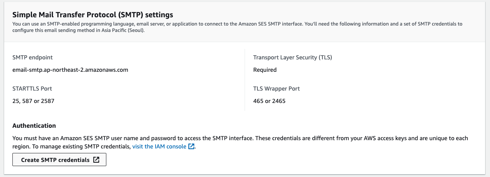
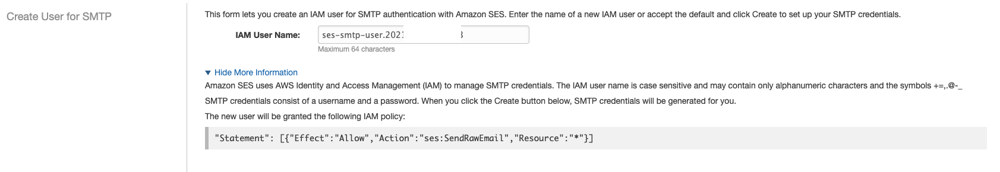
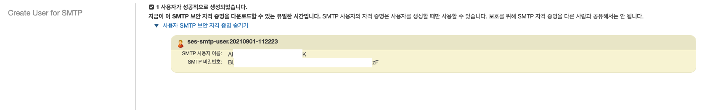

# SES Credential 생성하기. 

- SES 전용 IAM User를 생성하고, Credential 을 생성해 낼 수 있다. 

- 위와 같이 Authentication 영역에서 "Create SMTP credentials" 버튼을 클릭한다. 
- 클릭하면 다음과 같은 화면이 나타난다. 

- 여기에서 사용자 이름을 적절히 조정해주자.
- 그냥 사용해도 되지만, 이름을 규칙에 맞게 생성하는 것을 추천한다. 
- 이름을 생성하면, AWS Console > IAM 에 신규 User가 생성이 된다. 
- 참고로 기존 유저에게 SES 권한을 부여하고자 한다면 아래 부분을 확장하면 권한등록을 어떻게 하는지 확인할 수 있다. 
- 자세한 내용은 [AWS자격증명](https://docs.aws.amazon.com/ko_kr/general/latest/gr/aws-sec-cred-types.html#access-keys-and-secret-access-keys) 부분을 참조해 보자.
- 하단에 생성하기를 하면 새로운 창이 열리면서 사용자가 생성되고, credential 을 확인할 수 있게 된다. 

- 보는 바와 같이 사용자 이름/비밀번호를 확인할 수 있다.  
